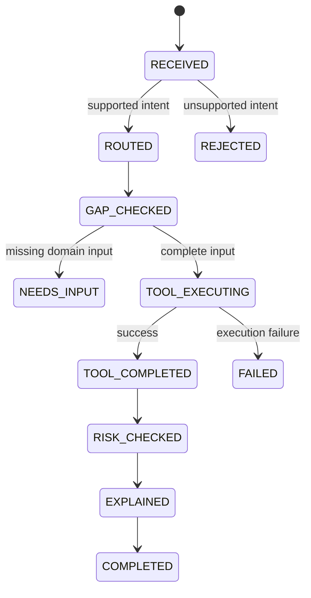

# FinTwin Deterministic Agent

## 정의와 범위

FinTwin Agent는 범용 AI 챗봇이나 자율 계획 Agent가 아니다. 구조화된 Intent를 서버 Allowlist로 검증하고, 필요한 입력이 모두 있을 때 허용된 기존 금융 서비스 하나를 실행하는 결정론적 Workflow Orchestrator다. 금융 계산, 누락값 추정, 상품 추천, 자연어 분류와 외부 AI 호출은 담당하지 않는다.

```text
Structured Intent
  -> Intent Allowlist
  -> Information Gap Check
  -> One Allowed Primary Tool
  -> Existing Deterministic Service
  -> Rule-based Risk Check
  -> Rule-based Explanation
  -> Typed Result
```

일반 AI 챗봇과 달리 사용자 문장으로 Tool 이름·클래스·메서드·URL을 선택할 수 없고, 재시도·Agent loop·Tool chaining·자율 계획 변경이 없다.

## 지원 Intent와 Tool Allowlist

| Intent | 고정 Tool | 기존 서비스 |
|---|---|---|
| `BASELINE_SIMULATION` | `BASELINE_SIMULATION_TOOL` | `BaselineSimulationService.simulate` |
| `WHAT_IF_SIMULATION` | `SCENARIO_COMPARISON_TOOL` | `ScenarioSimulationService.compare` |
| `GOAL_REVERSE_SIMULATION` | `GOAL_REVERSE_SIMULATION_TOOL` | `GoalReverseSimulationService.reverseSimulate` |

그 밖의 Intent는 `REJECTED`와 `UNSUPPORTED_INTENT`를 반환하며 Tool을 실행하지 않는다. Router는 명시적 `switch`만 사용한다. Pattern CSV API, 투자 조언, 상품 추천, 부동산·주가 예측과 일반 대화는 Agent에 연결하지 않는다.

## 상태 머신



명시되지 않은 전이와 모든 terminal 상태 이후의 추가 전이는 예외로 차단한다.

## Information Gap 처리

공통 필수값은 `startYearMonth`, `horizonMonths`, `assumptions`다. 누락값은 임의 기본값으로 채우지 않고 `NEEDS_INPUT`, 누락 코드, 필드 경로와 규칙 기반 한국어 질문을 반환한다.

- Baseline: `events`, `goalType`, `targetAmount` 금지
- What-if: 이벤트 1개 이상 필요, goal 필드 금지
- 일회성 지출·추가 상환: `amount`, `effectiveYearMonth` 필요
- 기간 이벤트: `startYearMonth`, `endYearMonth` 필요
- 월 증감 이벤트: `monthlyDelta` 필요
- Goal: `goalType`, `targetAmount` 필요, `events` 금지
- 현재 Profile에 부채가 있을 때: `assumptions.monthlyDebtPayment` 필요

부채 여부는 Agent가 Repository를 읽지 않고 기존 `FinancialProfileService.getCurrentIfPresent` 경계를 통해 확인한다. Profile 금액은 Gap 응답이나 Trace에 포함하지 않는다. JSON 형식, 기간 허용값, 중첩 Assumption Validation과 기존 Event/Goal enum 검증 실패는 공통 400 응답을 사용한다.

## Primary Tool 1회 제한과 기존 서비스 재사용

한 요청의 `toolCallCount`는 0 또는 1이다. 오케스트레이터는 구체 Tool 세 개 중 Router가 고른 하나만 `switch`로 실행한다. 재시도, 병렬 실행, 대체 Tool 실행과 Tool 간 호출은 없다.

각 Tool은 기존 애플리케이션 서비스 메서드 한 개를 한 번 호출하고 결과를 Profile/User ID 없는 Agent 전용 강타입 Result로 매핑한다. What-if의 baseline/시나리오 동시 계산과 Goal Solver의 내부 반복은 기존 서비스 내부 계산이며 Primary Tool 호출은 하나다. Agent는 계산식을 복제하지 않고 결과를 저장하거나 Profile을 변경하지 않는다.

What-if 완료 결과의 기존 최종 요약 필드는 그대로 유지하며 `comparisonDetails`를 additive하게 제공한다. 이 상세 결과는 `ScenarioComparisonTool`이 이미 한 번 받은 `ScenarioComparisonResponse`의 privacy-safe 투영이며, 응답을 채우기 위한 두 번째 `compare`나 엔진 호출은 없다. 포함 항목은 Profile Version, Assumption, 정규화 Event, Baseline·What-if 월별 결과, Checkpoint, Final Comparison, Impact Summary와 계산 Warning이다. Profile ID, User ID, 사용자 원문, Vault와 Provider 요청·응답은 포함하지 않는다. `NEEDS_INPUT`, `REJECTED`, `FAILED`에서는 typed result가 없으므로 상세 금융 결과도 없다.

## Risk Checker

Risk Checker는 Tool 결과에 이미 존재하는 boolean, delta, goal status와 warning code만 읽는다. 시뮬레이션을 다시 실행하거나 새로운 금융 임계값을 만들지 않는다.

- `CASH_SHORTFALL`: `HIGH`
- `NEGATIVE_AMORTIZATION`: `WARNING`
- `NET_WORTH_DECREASE`: `WARNING`
- `LIQUID_ASSET_DECREASE`: `INFO`
- `GOAL_NOT_ACHIEVED`: `WARNING`
- `EXPENSE_REDUCTION_INFEASIBLE`: `WARNING`
- `INVESTMENT_CONTRIBUTION_CASH_LIMITED`: `WARNING`

## Rule-based Explanation

설명은 `headline`, `summary`, `evidence`, `assumptionNotice`, `disclaimer`로 구성된다. Evidence는 `typedResult.netWorthDelta` 같은 필드 경로와 해당 Tool 결과의 정확한 값을 가진다. 외부 LLM을 호출하지 않으며 추천, 수익 보장, 경제 예측과 누락값 추정을 하지 않는다.

## 실행 Trace

Trace는 요청 처리 중 메모리에만 존재하고 DB에 저장하지 않는다. 각 Step은 다음 네 필드만 가진다.

- `sequence`
- `state`
- `component`
- `outcomeCode`

금액, 사용자 문장, User/Profile ID, 거래정보, Vault, 계산 상세와 Stack Trace는 포함하지 않는다. `FAILED` 응답은 `TOOL_EXECUTION_FAILED`만 노출하고 내부 예외 메시지를 버린다.

## API

```http
POST /api/agent/execute
Content-Type: application/json
```

사용자 ID는 요청에 없고 기존 `CurrentUserIdProvider` 인증 경계에서 얻는다. 기존 CSRF와 인증 정책이 그대로 적용된다.

Baseline 요청:

```json
{
  "intent": "BASELINE_SIMULATION",
  "startYearMonth": "2026-08",
  "horizonMonths": 36,
  "assumptions": {
    "annualIncomeGrowthRate": 3.0,
    "annualInflationRate": 2.0,
    "annualDepositInterestRate": 2.5,
    "annualInvestmentReturnRate": 5.0,
    "monthlyDebtPayment": 500000
  }
}
```

What-if 요청은 같은 공통 필드와 구조화된 `events`를 사용하며, Goal 요청은 `goalType`과 `targetAmount`를 사용한다. 자연어 요청은 받지 않는다.

완료 응답의 축약 예시:

```json
{
  "status": "COMPLETED",
  "intent": "BASELINE_SIMULATION",
  "selectedTool": "BASELINE_SIMULATION_TOOL",
  "resultType": "BASELINE",
  "typedResult": {
    "startYearMonth": "2026-08",
    "horizonMonths": 36,
    "finalYearMonth": "2029-07",
    "finalNetWorth": 42000000.00,
    "cashShortfallMonths": [],
    "negativeAmortizationMonths": []
  },
  "risks": [],
  "explanation": {
    "headline": "설정한 가정에 따른 36개월 후 순자산 결과입니다.",
    "evidence": [
      {"fieldPath": "typedResult.finalNetWorth", "value": "42000000.00"}
    ]
  },
  "toolCallCount": 1
}
```

누락 응답의 축약 예시:

```json
{
  "status": "NEEDS_INPUT",
  "selectedTool": "SCENARIO_COMPARISON_TOOL",
  "missingInformation": [
    {
      "code": "EVENT_AMOUNT_REQUIRED",
      "field": "events[0].amount",
      "question": "해당 금융 이벤트의 금액을 입력해주세요.",
      "requiredForIntent": "WHAT_IF_SIMULATION"
    }
  ],
  "toolCallCount": 0
}
```

예시 금액은 API 구조 설명용이며 결과나 수익을 보장하지 않는다.

## Privacy Boundary 연결

자연어 What-if 흐름은 다음 경계 순서를 유지한다.

```text
Natural language
  -> Strict Privacy Boundary
  -> ExternalAiScenarioRequest
  -> OpenAI Responses API / strict Structured Output
  -> ExternalAiScenarioDraft
  -> ExternalAiDraftValidator
  -> ReferenceRehydrator
  -> Validated FinancialEvent
  -> AgentCommand
  -> Allowlist Router
  -> Scenario Tool
```

`ValidatedScenarioAgentCommandFactory`는 Privacy 패키지 안에서 `ReferenceRehydrator` 검증이 성공한 Draft만 What-if Command로 변환한다. Agent 패키지는 Vault와 External AI Gateway에 의존하지 않는다. Profile, 거래, Pattern/Simulation/Goal 결과, Risk와 Agent 응답은 외부 AI Payload로 보내지 않는다. 외부 AI는 금융 계산이나 Tool 실행을 담당하지 않는다. 연결과 오류 정책은 `docs/OPENAI_ADAPTER.md`를 따른다.

자연어 API의 전체 비교 결과는 로컬 엔진에서 인증된 Browser 방향으로만 반환한다. 같은 정규화 Event와 Assumption을 직접 Compare에 입력하면 Profile Version, 월별 Series, Checkpoint, Final, Impact와 Warning이 `BigDecimal.compareTo` 의미로 일치해야 한다. AI Metadata, Trace, Risk 표현과 설명 문장은 이 금융 결과 일치 기준에서 제외한다.

## 지원하지 않는 기능

- Baseline·Goal 자연어 실행과 범용 자연어 Intent 분류
- 자유형 Agent loop, Multi-agent, Tool 재시도·연쇄·병렬 실행
- Pattern CSV Tool 연결, 시나리오·실행 이력 저장
- 금융상품·투자 추천, 신규 대출·자동차 할부
- 외부 URL·스크립트·Reflection 기반 Tool 실행
- Profile 변경, 결과 DB 저장
